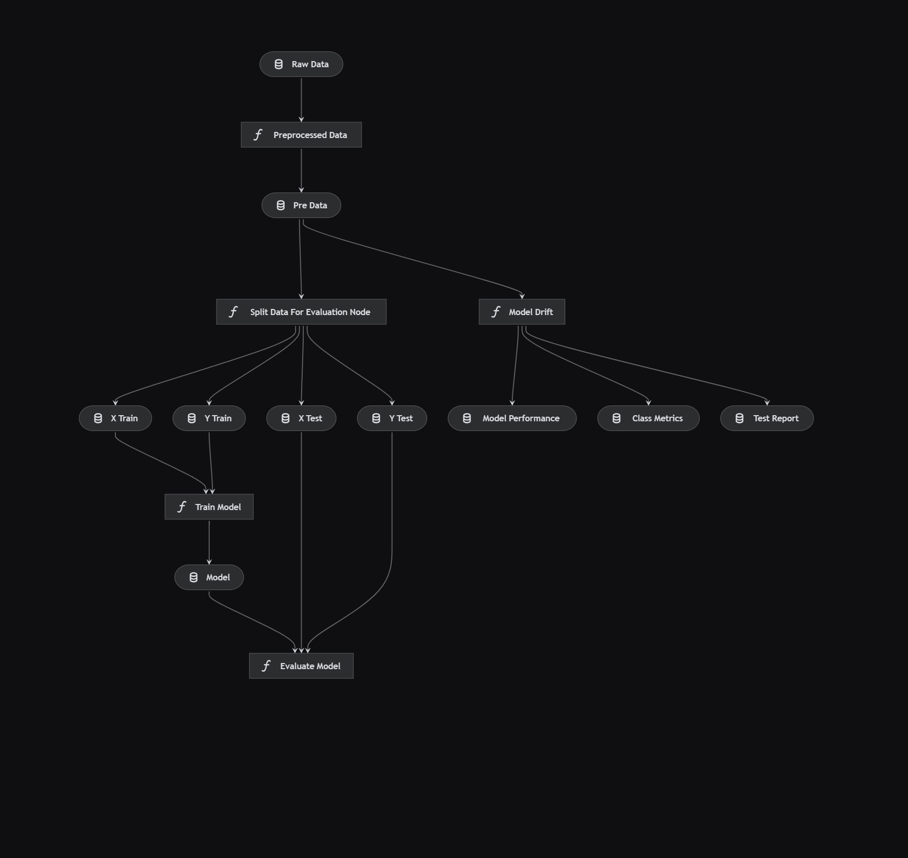
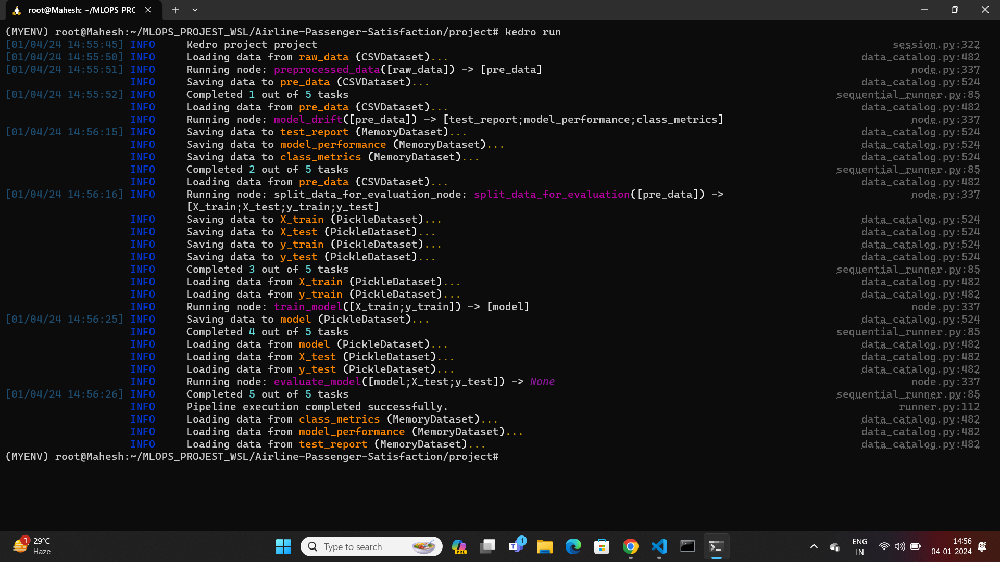
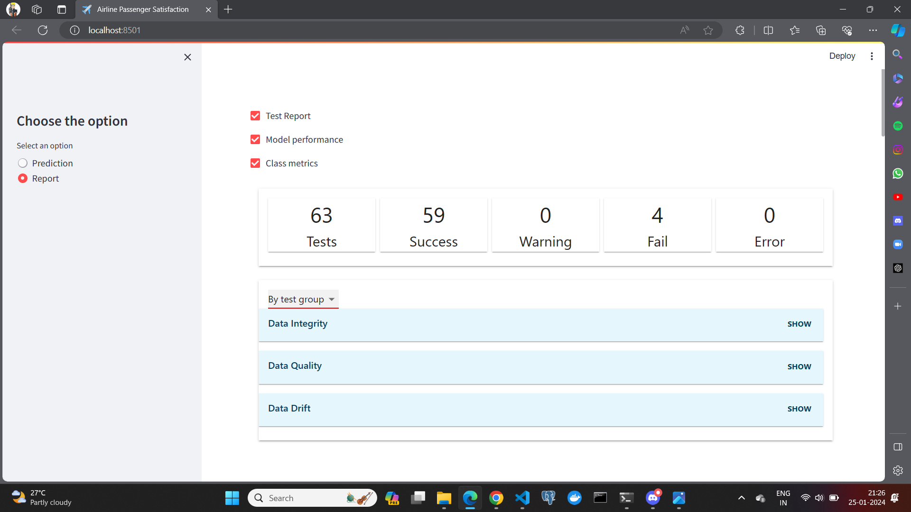
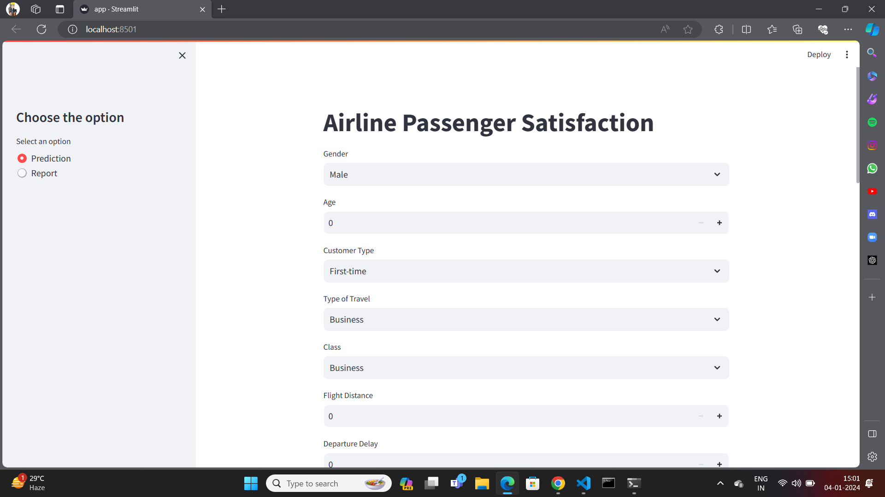
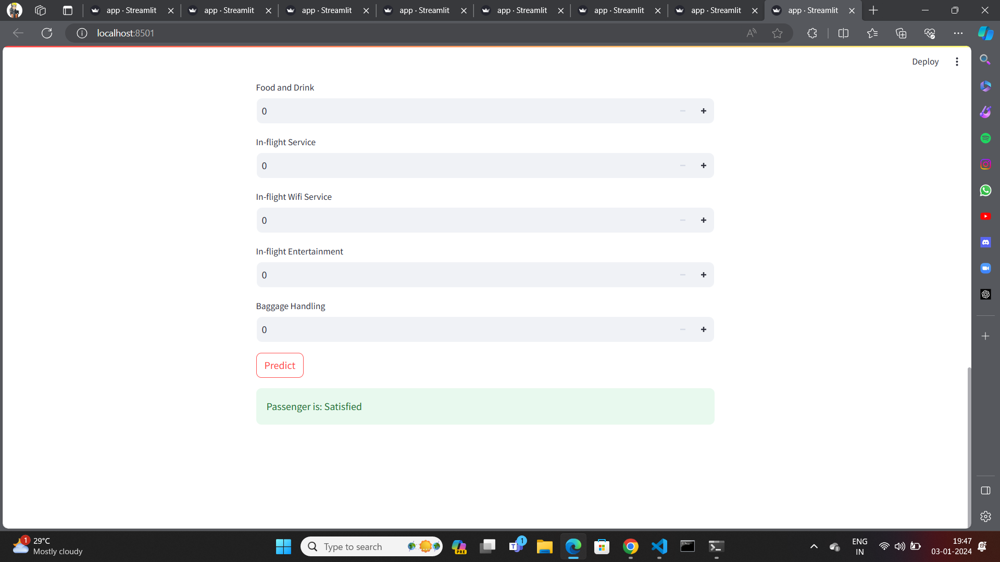

#  ✈️ **Crafting End-to-End MLOPS Magic for Airline Passenger Satisfaction** ✈️

## 🚀 Project Overview :
I'am on a mission to make your flight experiences better! Our project uses smart technology, called Machine Learning, to figure out what makes passengers satisfied or unsatisfied during their flights. We want to understand the important things that affect how satisfied people are when they travel.

## 🤖 What I'am Doing :
I'am using a special kind of technology, Machine Learning, to predict and understand what factors play a big role in making passengers happy or not so happy. It's like teaching a computer to learn from past experiences so we can make future flights even better.

## 📊 Why it Matters :
Imagine if we could make your flights more enjoyable and stress-free. By figuring out what really matters to passengers, we can help airlines improve the things that make a big difference. It's all about making your journey smoother and more satisfying.
 
**📅 Data Source :**  https://www.kaggle.com/datasets/mohamedhamdymady/airline-passenger-satisfaction?resource=download

## Advanced Machine Learning Pipelines for Airline Passenger Satisfaction Project using Kedro Framework:🚀💻





### Data Ingestion:
- **Module:** data_ingestion 📥
- **Description:** Ingest and import the raw dataset from diverse sources, ensuring data completeness and consistency.
- **Output:** raw_data 📊

### Data Preprocessing:
- **Module:** data_preprocessing 🛠️
- **Description:** Cleanse and transform the raw data, handle missing values, and ensure data quality.
- **Output:** processed_data 🧹

### Data Splitting:
- **Module:** data_splitting 🚀
- **Description:** Split the processed data into training and testing sets to facilitate model training and evaluation.
- **Output:** train_data, test_data 📊

### Model Training:
- **Module:** model_training 🤖
- **Description:** Utilize RandomForest algorithm to train a robust Machine Learning model based on the training dataset.
- **Input:** train_data
- **Output:** trained_model 🎓

### Model Evaluation:
- **Module:** model_evaluation 📈
- **Description:** Evaluate the trained model's performance using the testing dataset and fine-tune parameters for optimal results.
- **Input:** trained_model, test_data
- **Output:** model_metrics 📊


### Data Drift Monitoring:
- **Module:** data_drift_monitoring
- **Description:** Leverage Evidently AI for advanced data drift detection and generate comprehensive reports highlighting any shifts in data distribution.
- **Input:** raw_data, processed_data 📥🧹
- **Output:** data_drift_report 🌐🖼️📊




## Necessary Installations 🛠️

To ensure the smooth functioning of this project, several installations are required:

**1.clone the repository to ur local machine**
```bash
git clone https://github.com/MaheshGowda47/Crafting-End-to-End-MLOPS-Magic-for-Airline-Passenger-Satisfaction.git
```

**2.Setting Up the Environment**
```bash
python3 -m venv MYENV
```

**3.Activate the Virtual Environment**
To activate the virtual environment (assuming it's named MYVENV), use the following command:

```bash
source MYVENV/bin/activate
```

**4.Install Required Packages**

```bash
python3 -m pip install -r requirements.txt
```

## Run kedro framework
```bash
kedro run
```

## Running the Project 🚀

**1. Add path**
```bash
cd project
```

**2. Run streamlit app**
```bash
streamlit run app.py
```



